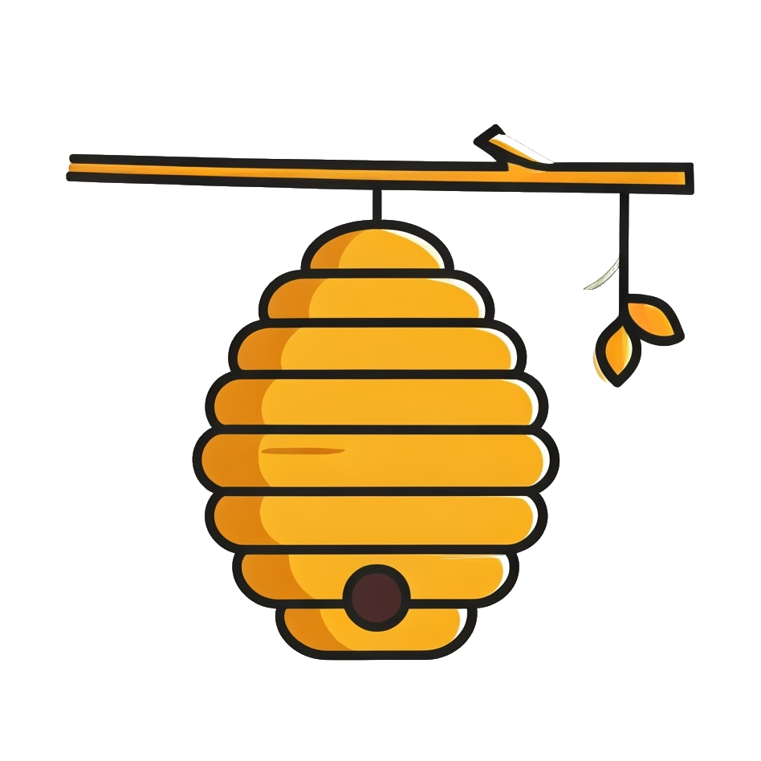

<!-- _class: title -->

# Stockerl
## Die digitale Stockkarte

---

<!-- _class: chapter -->

# Warum (noch) eine Imker App?

---

# Warum (noch) eine Imker App?

**Meine Überlegungen, als ich mit der Imkerei angefangen habe**

- 📝 Eine Stockkarte auf Papier kann verloren gehen und muss extre eingepackt werden
- 📱 Eine Stockkarte im Handy habe ich immer dabei

**Also habe ich verschiedene Apps ausprobiert**

- Ich habe keine einfachen, intuitiven Apps gefunden, die die Kernfunktionen für mich als Imker geboten haben
- Bei einer App habe ich es nichtmal geschafft, einen Bienenstock zu löschen

**Mein Impuls: Das kann ich besser!**

---

<!-- _class: chapter -->

# Was kann die App?

---

# Was kann die App?

**📝 Stockkarten führen & Durchsichten dokumentieren**

Völker verwalten, Beobachtungen erfassen, Fütterung & Varroa-Behandlung notieren.

**🍯 Ernten und Abfüllungen im Honigbuch aufzeichnen**

Ernten mit Menge, Honigtyp und Völkerzuordnung erfassen & Abfüllungen des Honigs tracken.

**🖨️ Export in verschiedene Formate**

Die Daten lassen sich als PDF Dokument sowie in weitere Formate exportieren.

---

# Wichtige Designentscheidungen

**✨ Intuitive Benutzeroberfläche**

Jeder soll ohne Vorkenntnisse oder langwierige Erklärungen die App nutzen können.

**☁️ Offline als Standard und optionale Cloud Anbindung**

Alles direkt auf dem Handy. Synchronisation und Cloud Sicherungen sind optional möglich.

**🚀 Basisfunktionen grundsätzlich Kostenlos**

Jeder soll die App verwenden können und seine Bienenstöcke und sein Honigbuch verwalten.

**💎 Trotzdem gibt es Premium-Funktionen**

Cloud-Backup und Gerätesynchronisation gehören für mich dazu. Leider kosten Server Geld...

---

TODO: Video ?

---
<!-- _class: chapter -->

# Was passiert unter der Haube?

---

## Wie die App technisch funktioniert

**🔧 Flutter - Ein Code für alle Plattformen**
Code wird einmal geschrieben und läuft auf allen unterstützten Plattformen. Dadurch können eine Web und iOS Version später (relativ) einfach hinzugefügt werden.

**💾 Offline-First mit SQLite + PostgreSQL**
Eine SQLite-Datenbank auf Ihrem Gerät ermöglicht die offline Nutzung. PowerSync synchronisiert automatisch bei Internet mit einer PostgreSQL Datenbank.

**🔒 Supabase statt Firebase**
Open Source Backend (kein Google Vendor Lock-in) stellt die  PostgreSQL mit Row Level Security bereit, so dass jeder nur seine eigenen Daten sieht.

---

## Geplante Features

**📎 Erweiterte Verwaltungsfunktionen**

PDF- & Bild-Upload für Prüfberichte des Honigs, Archivierung alter Völker wenn ein Stock ausgetauscht wird.

**📊 Statistiken & Dashboards**

Auswertungen zur Honigproduktion und Völkerentwicklung auf einen Blick.

**💻 Online-Version & iOS**

Web-Version für größere Bildschirme und Nutzer ohne Android. iOS hoffentlich später, wenn ich irgendwann ein Testgerät habe.

---

<!-- _class: chapter -->

# Ich brauche Unterstützung

---

# Werde Beta-Tester

## Google will mindestens 12 Tester, bevor ich die App veröffentlichen kann

**🎁 1 Jahr Premium komplett kostenlos**

Keine Zahlungsdaten nötig, kein Abo, läuft nach einem Jahr einfach aus.

**🚀 Frühzugang vor dem offiziellen Release**

Du kannst die App schon jetzt nutzen, während andere noch warten müssen.

**💬 Direkter Austausch & Mitgestaltung**

Deine Ideen fließen direkt in die Entwicklung ein – ich bin nur eine Nachricht entfernt.

---

## So nimmst du am Beta-Test teil

**1️⃣ E-Mail mit kurzer Vorstellung**

Schreib mir an **janosch@stockerl.app** – stell dich kurz vor (Wie viele Völker? Wie lange imkerst du schon?).

**2️⃣ Ich nehme dich in die Beta-Gruppe auf**

Du bekommst von mir den Zugang zur App.

**3️⃣ WhatsApp-Gruppe beitreten**

Bleib auf dem Laufenden über Updates und tausche dich mit anderen Testern aus.

**4️⃣ App herunterladen & Feedback geben**

Lade Stockerl herunter und sag mir, was funktioniert und was nicht.

  

    QR Code Website stockerl.app
  

  

    QR Code WhatsApp Gruppe
  

---

## Was ich von Ihnen brauche

### Einfach benutzen und mir sagen:

✓ **Ist es verständlich?** – Oder wo haben Sie gestutzt?
✓ **Funktioniert es?** – Oder ist was abgestürzt?
✓ **Was fehlt Ihnen?** – Welche Funktion vermissen Sie?
✓ **Was nervt?** – Ehrliches Feedback ist Gold wert!

**Lassen Sie uns gemeinsam die beste digitale Stockkarte bauen!**

---

<!-- _class: title -->

## Stockerl
### Die App, die immer funktioniert

**Von einem Imker für Imker entwickelt** 🐝

**https://stockerl.app**

*Danke für Ihre Aufmerksamkeit!*

---
